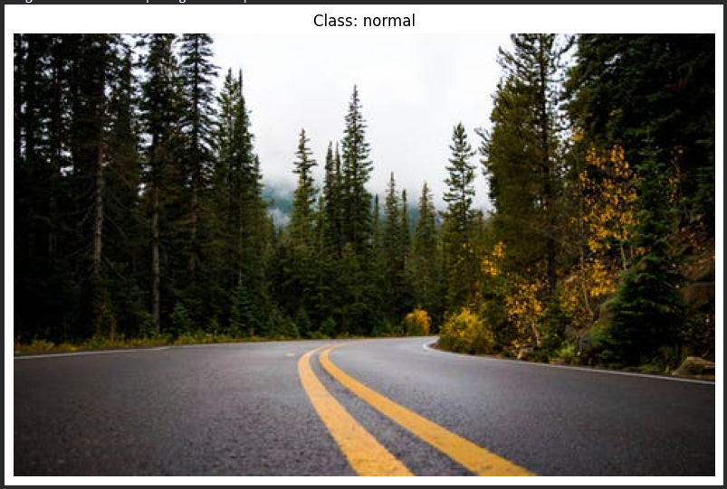
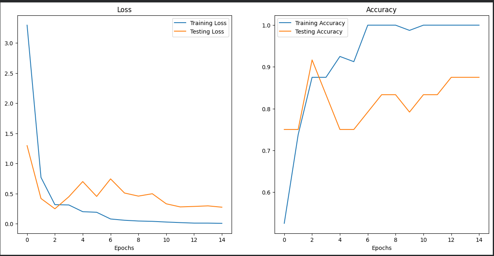
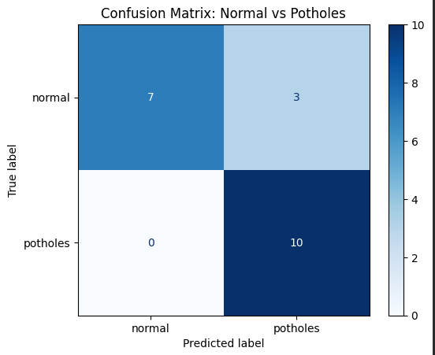
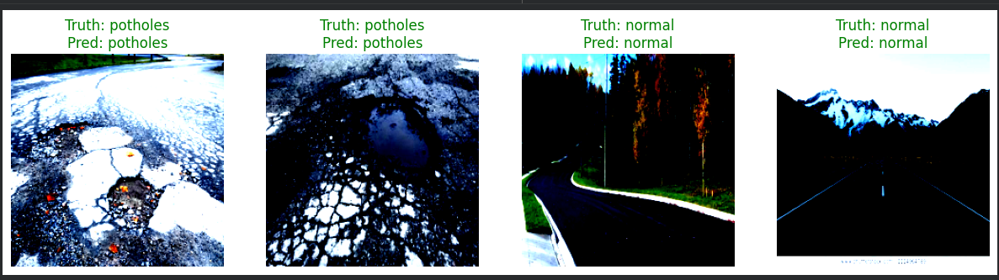

# Pothole-Damage-Detection
Automated Pothole Damage Detection system built with Python. Features include image data preprocessing, classification modeling, and performance evaluation.

**[Click here to read the Full Project Report Document (PDF)](Dokumen%20Penjelasan%20Project.pdf)**

# Pothole Damage Detection using PyTorch

This project is an *End-to-End Machine Learning* implementation for *Image Classification*, designed to detect road damage (potholes). The system automatically distinguishes between **Normal** road conditions and **Potholes** using a *Convolutional Neural Network* (CNN) architecture built *from scratch*.

This project was created to demonstrate a deep understanding of the *Computer Vision* workflow, starting from raw data preparation and *Deep Learning* model engineering, to the testing (*inference*) stage on real-world data.

---

## Technologies & Libraries Used
This project was fully developed using **Python** in the Google Colab environment, with the following main stack:
* **Deep Learning Engine:** PyTorch (`torch`, `torch.nn`), Torchvision
* **Data Processing & Pipeline:** `os`, `shutil`, `pathlib`, `random`
* **Model Validation:** `torchinfo`
* **Data Visualization:** Matplotlib, PIL (Python Imaging Library)

---

## Project Pipeline (Workflow)

### 1. Data Handling & Train-Test Split
Managing raw datasets is often a major challenge. In this project, directory structures were created dynamically using the `os` and `shutil` modules. The data was split into **80% Training** and **20% Testing**. The use of `random.seed(42)` was implemented to ensure *reproducibility* (consistent results every time the pipeline is run).

### 2. Exploratory Data Analysis (EDA) & Sanity Checks
Before entering the *training* phase, this project was equipped with *defensive programming* to filter out *hidden files* (such as `.DS_Store` or `thumbs.db`) that could potentially break the *DataLoader*. Random visualization was also performed at this stage to understand the characteristics of the original image resolutions.

  

### 3. Data Preprocessing & Augmentation
Image transformations were performed using `torchvision.transforms`:
* **Resize:** Standardizing all inputs to `224x224` pixel dimensions.
* **Augmentation (Training Data Only):** Applying `RandomHorizontalFlip(p=0.5)` to add data variance and prevent the model from *overfitting*.
* **Industry Standard Normalization:** Converting pixel values to Tensors and normalizing them using the *mean* `[0.485, 0.456, 0.406]` and *standard deviation* `[0.229, 0.224, 0.225]` according to ImageNet dataset standards to make the model more stable.

### 4. Model Architecture (Custom CNN)
The `PotholeModel` does not use a *pre-trained model*; instead, it was custom-designed utilizing `torch.nn`.
* **Feature Extractor:** Utilizing convolutional blocks (`Conv2d`) with a 3x3 *kernel size* and a *padding* of 1, followed by `ReLU` activation functions and `MaxPool2d` to mathematically reduce the spatial dimensions of the images.
* **Classifier:** Utilizing `Flatten` and `Linear` layers. The input dimensions for the linear layer were calculated precisely (the result of dimensionality reduction to `112x112` from the initial `224x224` input).

### 5. Training Loop & Optimization
The model training process ran for **15 Epochs**. The model was trained using:
* **Loss Function:** `CrossEntropyLoss` (ideal for multi-class/binary classification with *raw logits*).
* **Optimizer:** `Adam` optimizer with a *learning rate* of `0.001` for fast and stable convergence.

  

### 6. Model Evaluation & Inference
Evaluation on the *test set* was executed in `model.eval()` and `torch.inference_mode()` to disable gradient tracking. This significantly saves memory usage and speeds up computation. The system is also equipped with a specific function to test entirely new images (outside the dataset) by applying the **Softmax** mathematical function to generate the AI's **Confidence Level percentage**.

---

## Results & Visualizations

To validate the model's performance, here are the evaluation metrics and prediction results on the test dataset:

**1. Confusion Matrix**
The model effectively distinguishes between normal roads and potholes, as shown in the confusion matrix below.

  

**2. Inference / Prediction Samples**
Below are examples of the model's predictions comparing the Ground Truth against the AI's Predicted labels. The model correctly identified both the pothole damage and normal road conditions.

  

---

## How to Run
1. Clone this repository to your local directory.
2. Open the `pothole_detection.ipynb` notebook using Google Colab or Jupyter Notebook.
3. Download `dataset_sampel.zip` and `dataset_baru.zip` (in the dataset folder), and upload them to Google Drive or directly to your local Colab system.
4. Adjust the directory path variables in the ZIP extraction cell according to your dataset's location.
